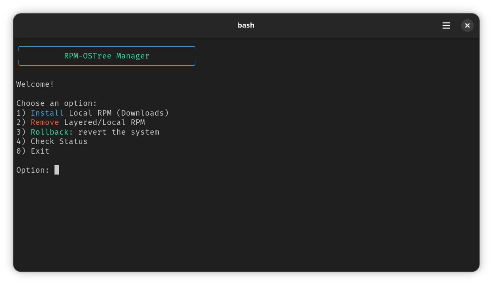
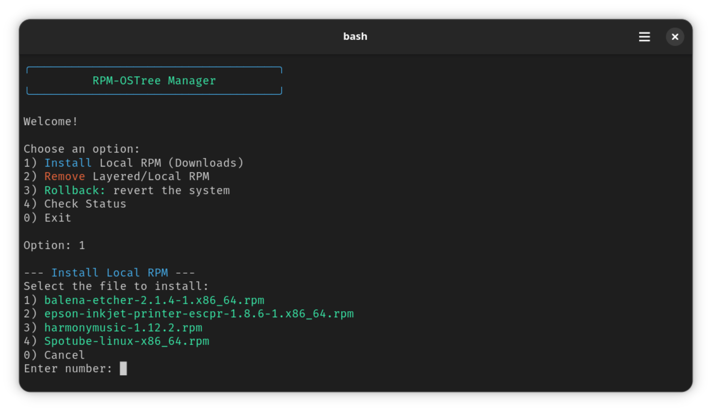
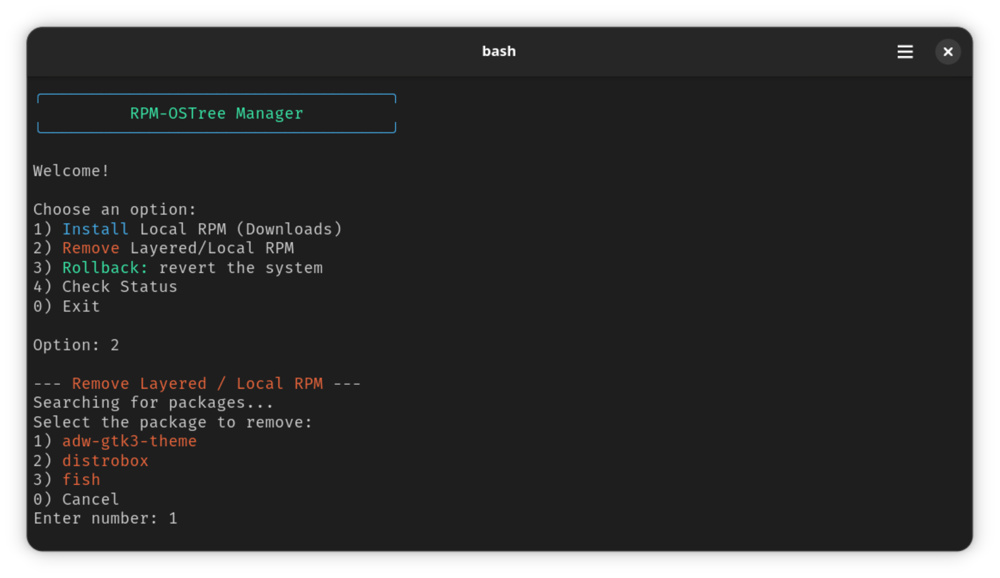

<p align="center">
  
</p>

[](https://fedoraproject.org/)
[](https://github.com/ublue-os/bazzite)
[](https://projectbluefin.io/)
[](https://github.com/ublue-os/aurora)

# Tabela de Conteúdo
[🇺🇸 English](https://github.com/diogopessoa/rpm-ostree-manager/blob/main/README.md) [🇧🇷 Português](https://github.com/diogopessoa/rpm-ostree-manager/blob/main/README-BR.md)
* [Tabela de Conteúdo](https://github.com/diogopessoa/rpm-ostree-manager/?tab=readme-ov-file#tabela-de-conteudo)
  - [Sobre e Funcionalidades](https://github.com/diogopessoa/rpm-ostree-manager/?tab=readme-ov-file#sobre-e-funcionalidades)
  - [Demonstração de Uso](https://github.com/diogopessoa/rpm-ostree-manager/?tab=readme-ov-file#demonstraçao-de-uso)
  - [Destino dos Arquivos](https://github.com/diogopessoa/rpm-ostree-manager/?tab=readme-ov-file#destino-dos-arquivos)
  - [Como instalar](https://github.com/diogopessoa/rpm-ostree-manager/?tab=readme-ov-file#como-instalar)
  - [Desinstalação](https://github.com/diogopessoa/rpm-ostree-manager/?tab=readme-ov-file#desinstalaçao)
  - [Créditos e Licença](https://github.com/diogopessoa/rpm-ostree-manager/?tab=readme-ov-file#creditos-e-licença)

## Sobre e Funcionalidades

Uma ferramenta CLI simples e intuitiva para instalar e gerenciar pacotes RPM locais e layered em sistemas Fedora Atomic (Silverblue, Kinoite, Bluefin, Bazzite, Aurora).

- **Instalar RPM Local:** Busca automática de RPM na pasta Downloads.
- **Remover RPM Local e Layered:** Listagem por ordem numérica dos pacotes instalados pelo usuário.
- **Rollback:** Reversão para o estado anterior do sistema.
- **Status:** Verifica pacotes layereds e pendentes.

## Demonstração de Uso

### Menu Principal


### Instalar RPM Local (Downloads)


### Desinstalar Layered / Local RPM


## Destino dos Arquivos

Este mapa mostra onde cada arquivo é colocado no seu sistema após a execução do instalador:

```text
Caminho de destino

├── /usr/local/bin/rom                                  # Principal executável (from rom.sh)
├── ~/.local/share/icons/rpm-ostree-manager.svg         # Ícone (from icon.svg)
└── ~/.local/share/applications/rpm-ostree-manager.desktop # Atalho no menu de aplicativos

```

## Como instalar

Execute o seguinte comando para instalar o RPM-OSTree Manager automaticamente:

```bash
curl -fsSL https://raw.githubusercontent.com/diogopessoa/rpm-ostree-manager/main/install.sh | bash
```

**Tudo pronto!** Após a instalação concluída com sucesso, você já pode encontrar o **RPM-OSTree Manager** no seu menu de aplicativos ou digitar `rom` no terminal.

## Desinstalação

Se você quiser remover o RPM-OSTree Manager, execute o commando:

```bash
sudo rm /usr/local/bin/rom && rm ~/.local/share/applications/rpm-ostree-manager.desktop ~/.local/share/icons/rpm-ostree-manager.svg && echo "RPM-OSTree Manager has been successfully uninstalled."
```

## Créditos e Licença

* **MIT License:** Licenciado sob a [MIT License](https://github.com/diogopessoa/rpm-ostree-manager/blob/main/LICENSE).
* **Ícone:** Faz parte do projeto [Kora Icons](https://github.com/bikass/kora), licenciado sob a GPL-3.0.


