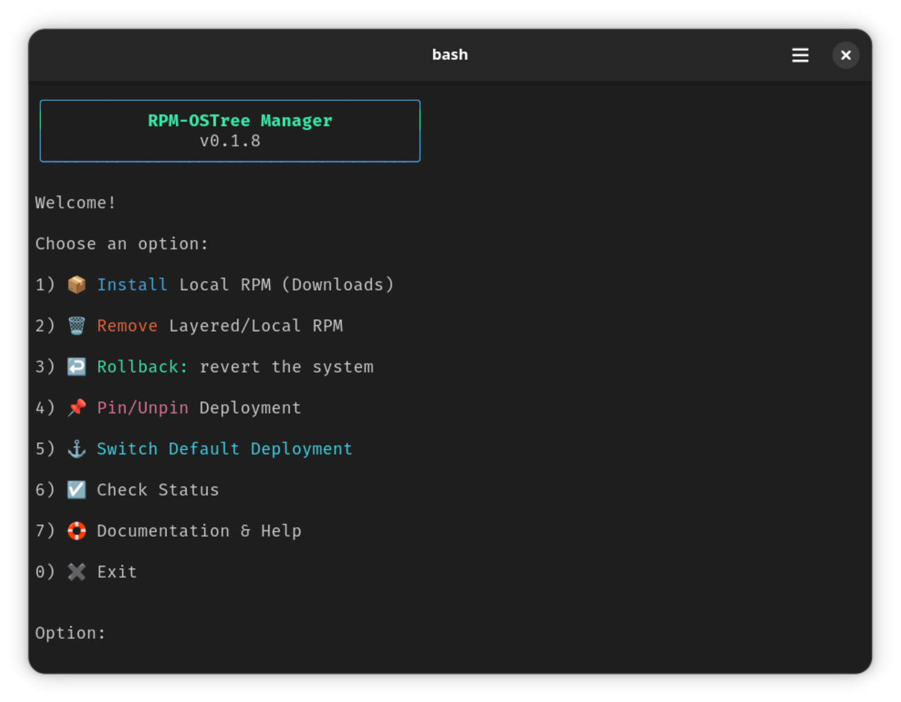

<p align="center">
  
</p>

[](https://fedoraproject.org/)
[](https://github.com/ublue-os/bazzite)
[](https://projectbluefin.io/)
[](https://github.com/ublue-os/aurora)

# Table of Contents
[🇺🇸 English](https://github.com/diogopessoa/rpm-ostree-manager/blob/main/README.md) [🇧🇷 Português](https://github.com/diogopessoa/rpm-ostree-manager/blob/main/README-BR.md) 
* [Table of Contents](https://github.com/diogopessoa/rpm-ostree-manager/?tab=readme-ov-file#table-of-contents)
  - [About and Features](https://github.com/diogopessoa/rpm-ostree-manager/?tab=readme-ov-file#about-features)
  - [Features](https://github.com/diogopessoa/rpm-ostree-manager/?tab=readme-ov-file#features)
  - [Main Menu](https://github.com/diogopessoa/rpm-ostree-manager/?tab=readme-ov-file#main-menu)
  - [Demo](https://github.com/diogopessoa/rpm-ostree-manager/?tab=readme-ov-file#demo)
  - [File Destination](https://github.com/diogopessoa/rpm-ostree-manager/?tab=readme-ov-file#file-destination)
  - [Installation](https://github.com/diogopessoa/rpm-ostree-manager/?tab=readme-ov-file#installation)
  - [Uninstallation](https://github.com/diogopessoa/rpm-ostree-manager/?tab=readme-ov-file#uninstallation)
  - [Credits and License](https://github.com/diogopessoa/rpm-ostree-manager/?tab=readme-ov-file#credits-and-license)


## About

RPM-OSTree Manager is a simple and intuitive CLI tool to install and manage local and layered RPM packages on Fedora Atomic systems (Silverblue, Kinoite, Bluefin, Bazzite, Aurora).

>Due to the immutable base in atomic systems, layers should only be used as a last resort. Always prioritize installing packages in this order: Flatpak, containers, and finally layers (rpm-ostree).

## Features 

- **📦 Install Local RPM:** Scans for RPM packages in the **Downloads** folder and lists them numerically, or you can **drag** an RPM directly into the program window to install it from any location.
- **🗑️ Remove Local and Layered RPMs:** Lists user-installed packages numerically for easy uninstall.
- **↩️ Rollback:** Quickly revert the system to a previously selected state. 
- **📌 Pin/Unpin Deployment:** Pin a stable deployment to prevent being removed during updates. It will remain in the GRUB entry until you unpin it.
- **⚓ Switch Default Deployment:** Set any deployment as default (including pinned ones). This "anchors" your system to a specific version for future updates.
- **☑️ Status:** Check for layered packages, pending deployments and active system versioning.

💡 *Information:*
A deployment is the complete system image (base + layered packages) listed in rpm-ostree status, identified by an index (example: 0). Pinning it prevents automatic removal.
  
## Main Menu


## Demonstration

### Brief Overview Demo
<video src="https://github.com/user-attachments/assets/70e30d2d-cc4a-4772-8974-a99d58d4aaa8" width="100%" controls title="RPM-OSTree Manager Demo">
  Your browser does not support the video tag.
</video>

### Installing local RPM Demo
<video src="https://github.com/user-attachments/assets/28b7146e-b3f1-47a5-a333-b4450cceef2f" width="100%" controls title="Installing local RPM Demo">
  Your browser does not support the video tag.
</video>

These demonstrations shows only a portion of the features in action.

## File Destination

This map shows where each file is placed on your system after running the installer:

```
Destination Path

├── /usr/local/bin/rom                                  # Main executable (from rom.sh)
├── ~/.local/share/icons/rpm-ostree-manager.svg         # Icon file (from icon.svg)
└── ~/.local/share/applications/rpm-ostree-manager.desktop # Application Menu shortcut

```

## Installation
Run the following command to install or update RPM-OSTree Manager:

```bash
curl -fsSL https://raw.githubusercontent.com/diogopessoa/rpm-ostree-manager/main/install.sh | bash
```

**All done!** Once the installation is successful, you can find **RPM-OSTree Manager** in your application menu or simply type `rom` in your terminal.

## Uninstallation

If you want to uninstall RPM-OSTree Manager, run the command:

```bash
sudo rm /usr/local/bin/rom && rm ~/.local/share/applications/rpm-ostree-manager.desktop ~/.local/share/icons/rpm-ostree-manager.svg && echo "RPM-OSTree Manager has been successfully uninstalled."
```

## Credits and License

* **License:** [MIT](https://github.com/diogopessoa/rpm-ostree-manager/blob/main/LICENSE).
* **Icon:** The icon used is part of the [Kora Icons](https://github.com/bikass/kora) project.
* **Fedora Docs:** Fedora Atomic Desktops User Guide [Updates, Upgrades & Rollbacks](https://docs.fedoraproject.org/en-US/atomic-desktops/)


